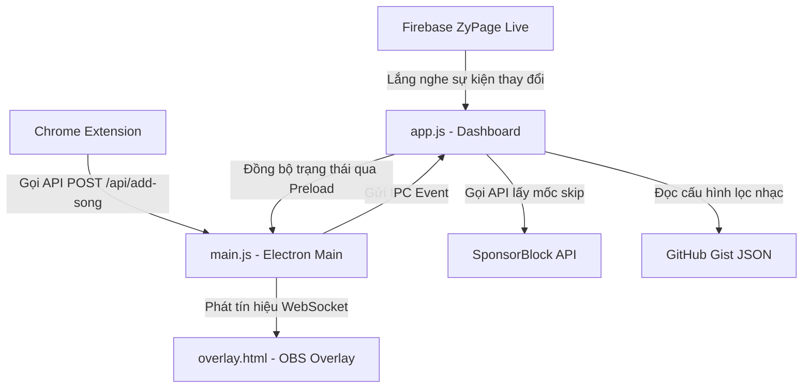

# 🍍 HƯỚNG DẪN ĐỌC HIỂU DỰ ÁN INTROVERT PLAYER (DỨA CORNER PLAYER)

Tài liệu này được biên soạn chi tiết dành cho Codex (hoặc các mô hình AI khác) để nhanh chóng nắm bắt cấu trúc thư mục, kiến trúc phần mềm, luồng xử lý dữ liệu và toàn bộ các chức năng của dự án **Introvert Player** (tính đến phiên bản **v26.8.0**).

---

## 📂 1. Cấu trúc thư mục & các tệp tin cốt lõi

Dưới đây là sơ đồ phân bổ các tệp tin chính trong dự án và vai trò của từng thành phần:

*   **`main.js`** (Electron Main Process):
    *   Khởi tạo và quản lý vòng đời ứng dụng Electron (chạy cửa sổ Desktop, khay hệ thống - Tray).
    *   Tích hợp cơ sở dữ liệu **SQLite** (`donations.db` nằm ở thư mục AppData) để lưu trữ lịch sử donate.
    *   Khởi tạo **HTTP Server nội bộ (cổng 3000)** phục vụ các REST API:
        *   `POST /api/config`: Lưu cấu hình ứng dụng vào `config.json`.
        *   `POST /api/save-walkthrough`: Lưu trữ tài liệu hướng dẫn và hỗ trợ deploy tự động lên Vercel.
        *   `POST /api/test-donate`: Nhận dữ liệu donate giả lập để kiểm thử.
    *   Khởi tạo **WebSocket Server (`ws://localhost:3000`)**: Cầu nối thời gian thực để đồng bộ trạng thái giữa Streamer Dashboard và OBS Overlay.
    *   Quản lý xác thực tài khoản YouTube (OAuth), trích xuất dữ liệu YouTube (qua `ytdl-core`, `play-dl`), và tự động cập nhật phần mềm qua GitHub Releases.
*   **`preload.js`** (Electron Preload Script):
    *   Sử dụng `contextBridge.exposeInMainWorld` để tạo ra API an toàn (`window.electronAPI`) kết nối Renderer Process với Main Process, đảm bảo bảo mật cho luồng gọi các tiến trình hệ thống, đọc/ghi file và truy cập SQLite.
*   **`index.html`** (Dashboard View) & **`app.js`** (Renderer Process của Dashboard):
    *   Trang điều khiển chính (Dashboard) dành cho Streamer.
    *   Chứa giao diện trình phát nhạc kiểu Spotify ở đáy màn hình và danh sách hàng đợi nhạc (Queue).
    *   Bên trong `app.js` xử lý:
        *   Kết nối trực tiếp tới **Firebase Realtime Database** của trang ZyPage (lắng nghe sự kiện để tự động nạp nhạc donate thời gian thực).
        *   Tích hợp API **SponsorBlock** để nhận diện các mốc thời gian quảng cáo, dạo đầu/kết thúc nhằm tự động skip.
        *   Xử lý tìm kiếm và gợi ý video YouTube cá nhân hóa với cơ chế đệ quy continuation (tối đa hiển thị 60 gợi ý) và debounce delay 150ms cực nhạy.
        *   Quản lý trạng thái **Focus Mode (Chế độ tập trung)** và các cơ chế giới hạn thời gian phát nhạc.
        *   Đồng bộ trạng thái phát nhạc (Play, Pause, Volume, Seek, Queue...) sang OBS Overlay qua WebSocket.
*   **`overlay.html`** (OBS Overlay View):
    *   Được thiết kế độc lập làm widget hiển thị nổi trên màn hình livestream của OBS.
    *   Kết nối với WebSocket Server nội bộ để đồng bộ giao diện phát nhạc theo thời gian thực (nền trong suốt, tự động ẩn khi không có nhạc phát).
    *   Tích hợp nhiều chủ đề thiết kế (Theme Dứa, TFT Spacegods, Cute Pink, Classic đĩa than cơ học xoay, Frosted Glass kính mờ).
    *   Hiển thị màn hình đỏ cảnh báo nhạy cảm 5 giây đè lên trên tất cả thành phần khác khi phát bài hát nhạy cảm.
*   **`styles.css`**:
    *   Chứa toàn bộ mã CSS, hệ thống màu sắc cho cả chế độ Sáng/Tối (Light/Dark Mode), thiết kế Responsive, và các hiệu ứng chuyển động như: Đĩa nhạc quay, Sóng nhạc chuyển động cơ học, Hiệu ứng thay đĩa cơ học (Vinyl Swap)...
*   **`extension/`** (Chrome Extension):
    *   Tiện ích mở rộng chạy trên Chrome/Edge để tích hợp nút `+` hoặc `+ Thêm nhanh` trực tiếp cạnh tiêu đề video trên trang YouTube (trang chủ, trang tìm kiếm, trang đề xuất bên lề).
    *   Bắt sự kiện click để gửi URL video đang xem trực tiếp về HTTP Server nội bộ của app, tự động thêm nhạc vào hàng đợi mà không cần copy paste thủ công.

---

## 🏗️ 2. Kiến trúc & luồng dữ liệu chính

Kiến trúc hoạt động của hệ thống được vận hành theo cơ chế phân tán nội bộ để đảm bảo tốc độ phản hồi tức thì dưới 10ms:



### A. Luồng đồng bộ nhạc từ ZyPage
1. Khi có người xem gửi tặng (donate) bài hát trên trang ZyPage của Streamer, một bản ghi mới được cập nhật trên Firebase Realtime Database.
2. `app.js` lắng nghe sự kiện thay đổi của Firebase (`put` event), lập tức gọi API ZyPage để lấy danh sách bài hát mới nhất.
3. Bài hát được giải mã thông tin (Tiêu đề, Thumbnail, Tên người donate, Số tiền, Thời gian yêu cầu) và đẩy vào danh sách hàng đợi phát nhạc.

### B. Luồng tương tác Dashboard <-> OBS Overlay (Local Sync)
1. Khi Streamer thực hiện thao tác trên Dashboard (ví dụ: bấm nút Skip, kéo tua nhạc, đổi theme, chỉnh volume):
   * `app.js` cập nhật trạng thái hiển thị nội bộ và gọi `window.electronAPI.sendOverlayMessage(payload)`.
   * Main Process (`main.js`) nhận được tin nhắn qua IPC và phát sóng (broadcast) tin nhắn này tới tất cả các kết nối WebSocket đang mở (`activeWsClients`).
   * Trang `overlay.html` (được OBS Studio nhúng làm Browser Source) nhận dữ liệu từ WebSocket kết nối nội bộ (`ws://localhost:3000`), cập nhật giao diện hiển thị ngay lập tức.
2. Cơ chế này giúp Overlay hoạt động hoàn toàn offline (mất kết nối internet vẫn đồng bộ âm lượng/bài hát cục bộ bình thường).

---

## ⚡ 3. Các tính năng kỹ thuật nâng cao & Cơ chế triển khai

### 1. Trình chặn SponsorBlock tự động
*   Khi chuẩn bị phát một bài hát mới, `app.js` gọi API SponsorBlock (`https://sponsor.ajay.app/api/skipSegments?videoID=...`).
*   Hệ thống nhận về mảng các khoảng thời gian không mong muốn (tài trợ, nhạc dạo đầu intro, outro, off-topic đối thoại).
*   Trong quá trình phát nhạc, một bộ theo dõi thời gian liên tục so sánh thời lượng phát hiện tại với các khoảng thời gian bị chặn. Nếu trùng khớp, trình phát sẽ tự động tua nhanh qua đoạn kết thúc phân khúc đó (Seek) kèm theo log ghi nhận trong bảng Nhật ký hoạt động.

### 2. Cảnh báo và bảo vệ nội dung nhạy cảm
*   Hệ thống cho phép Streamer cấu hình một liên kết GitHub Gist chứa tệp tin JSON cấu hình danh sách Video ID nhạy cảm (`sensitiveVideoIds`).
*   Để vượt qua sự kiểm duyệt hoặc chặn kết nối DNS của nhà mạng Việt Nam đối với GitHub Gist, ứng dụng sử dụng cơ chế proxy động thông qua các CORS proxy trung gian như `corsproxy.io` và `api.allorigins.win`.
*   Khi bài hát chuẩn bị phát nằm trong danh sách nhạy cảm:
    *   **Dashboard:** Hiển thị dải băng cảnh báo màu đỏ `#dash-sensitive-warning`.
    *   **Overlay (OBS):** Kích hoạt màn che đỏ rực rỡ đè lên toàn màn hình với dòng thông báo và đồng hồ đếm ngược 5 giây màu vàng. Âm lượng bài hát tự động chuyển về `0` (Mute) để tránh tiếng, đồng thời áp đặt `z-index: 999999` để đè lên các popup donate khác. Sau 5 giây kết thúc, âm lượng khôi phục về trạng thái cũ.

### 3. Chế độ Tập trung (Focus Mode)
*   Khi Streamer cần tập trung chơi game và không muốn bị phân tâm bởi nhạc hoặc các nút click nhầm:
    *   Kích hoạt switch **Tập trung**: Toàn bộ giao diện điều khiển, hàng đợi, gợi ý nhạc trên Dashboard bị làm mờ (`opacity: 0.55`) và khóa tương tác chuột (`pointer-events: none`).
    *   Ứng dụng lưu trạng thái phát dở dang hiện tại vào `localStorage` (khóa `dua_was_playing_before_focus`).
    *   Khi tắt Focus Mode: Tự động phục hồi và phát tiếp bài hát từ giây đã tạm dừng trước đó.

### 4. Tự thích ứng khi phát luồng Livestream (Livestream Adaptability)
*   Hệ thống kiểm tra thời lượng bài hát (nếu duration bằng `0` hoặc thuộc tính `isLive` từ YouTube SDK trả về `true`):
    *   Trang `overlay.html` tự động ẩn thanh tiến trình phát nhạc (progress bar).
    *   Hiển thị một Badge đếm ngược nổi bật màu hồng nhạt, chứa chữ số hiển thị tương phản cao màu tối kèm dấu chấm đỏ nhấp nháy: `● KẾT THÚC SAU X:XX`.
    *   Khóa chức năng tự động tải lại (F5) trang Overlay để tránh làm gián đoạn luồng phát trực tiếp.

### 5. Giao diện thay đĩa cơ học (Vinyl Swap Animation)
*   Với chủ đề Classic & Classic Dark: Khi chuyển bài hát, giao diện kích hoạt một hoạt ảnh mô phỏng máy phát nhạc cơ học cổ điển:
    1. Cần đọc đĩa nhạc nhấc ra khỏi vị trí đĩa tham cũ.
    2. Đĩa than cũ trượt sang bên trái và biến mất.
    3. Đĩa than mới chứa ảnh bìa bài hát mới trượt từ bên phải vào trung tâm và bắt đầu xoay.
    4. Cần đọc hạ xuống đĩa than mới để bắt đầu phát nhạc.

---

## 🛠️ 4. Quy trình vận hành và kiểm thử dự án

### Khởi chạy môi trường phát triển
Để chạy thử dự án trên môi trường cục bộ:
```bash
# Cài đặt thư viện
npm install

# Khởi chạy ứng dụng Electron ở chế độ dev
npm run dev
```

### Thử nghiệm tính năng Donate (Offline Testing)
*   Trên Dashboard có tích hợp bảng **Giả lập Donate**.
*   Điền tên người gửi, số tiền, lời nhắn, và đường dẫn bài hát YouTube -> bấm **Mô phỏng**.
*   Dashboard sẽ tự động nhận diện và phản hồi sự kiện như khi có lượt donate thực tế từ ZyPage (bao gồm hiệu ứng pháo hoa kéo dài 6 giây trên OBS Overlay).
