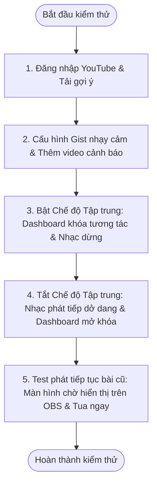

# Hướng dẫn Kiểm thử & Danh sách Thay đổi Chi tiết Introvert Player (v2.0.8 - v3.0.0)

Tài liệu này cung cấp danh sách đầy đủ, chi tiết từng thay đổi theo từng phiên bản từ **2.0.8** đến **3.0.0 (phiên bản hiện tại)** của **Introvert Player**, đi kèm với các bước hướng dẫn kiểm thử chi tiết cho từng thay đổi đó để bạn dễ dàng nghiệm thu.

---

## I. NHẬT KÝ THAY ĐỔI CHI TIẾT & HƯỚNG DẪN KIỂM THỬ THEO PHIÊN BẢN

### 1. Phiên bản [3.0.0] - 2026-06-13 (Cập nhật hiện tại)
* **Các thay đổi:**
  - **Khóa Dashboard khi bật Focus Mode:** Vô hiệu hóa và làm mờ (`opacity: 0.55`, `pointer-events: none`) toàn bộ các khu vực điều khiển phát nhạc, form thêm nhanh, danh sách gợi ý/playlist, cấu hình mốc thời gian và danh sách hàng đợi nhạc khi chế độ Tập trung hoạt động.
  - **Tự động Resume bài hát dở dang khi tắt Focus Mode:** Lưu trạng thái phát dở dang qua `localStorage` (khóa `dua_was_playing_before_focus`) để đảm bảo không bị mất khi reload/khởi động lại ứng dụng. Đồng thời, loại bỏ kiểm tra `!state.isPlaying` để tránh trễ đồng bộ (race conditions), đảm bảo bài nhạc tự động khôi phục chạy tiếp ngay khi tắt chế độ này.
  - **Giữ nguyên hàng đợi tĩnh khi tắt Focus Mode:** Nếu nhạc đã kết thúc hoàn toàn trong lúc bật Focus Mode, khi tắt chế độ này, hàng đợi vẫn ở trạng thái dừng (không tự động nhảy sang bài tiếp theo).
  - **Sửa lỗi hiển thị bài hát của Chủ Kênh trên Overlay:** Sửa lỗi thiếu thuộc tính `isOwnerAdd` và `nextSongIsOwnerAdd` trong payload gửi qua WebSocket/MQTT khi đồng bộ hoặc kết nối lại, đảm bảo Overlay luôn hiển thị đúng giao diện ẩn tên/số tiền của chủ kênh thêm.
  - **Sửa lỗi nhãn "Chủ kênh thêm" trong Dark Mode:** Chuyển sang class CSS `.owner-add-badge` ép buộc chữ đen nền vàng nổi bật khi chuyển sang chế độ tối.
* **Cách kiểm thử:**
  1. Thêm một bài hát mới với checkbox **Chủ kênh thêm nhạc** được chọn. Mở Overlay và kiểm tra xem tên người gửi đã được ẩn đi và thay bằng lời chờ chưa.
  2. Bấm F5/Reload trang Overlay hoặc bấm nút **Reset Overlay** trên Cấu hình và xác nhận xem Overlay sau khi load lại vẫn nhận đúng thông tin chủ kênh thêm (không bị nhảy về hiển thị tên/số tiền mặc định).
  3. Bật Dark Mode trên Dashboard và kiểm tra xem badge `Chủ kênh thêm` trong hàng đợi có hiển thị chữ màu đen trên nền vàng nổi bật hay không.
  4. Phát một bài hát, bấm bật switch **Tập trung**. Xác nhận giao diện điều khiển bị mờ và khóa tương tác chuột. Bấm tắt switch **Tập trung** và xác nhận bài hát tự động phát tiếp tục từ đoạn đang chạy dở.

---

### 2. Phiên bản [2.0.32] - 2026-06-12
* **Các thay đổi:**
  - **Thiết kế lại giao diện Tab Cấu hình:** Chuyển sang bố cục dạng Phân Mục (Sidebar Layout) với sidebar bên trái chứa danh mục lớn và bên phải chứa nội dung chi tiết.
  - **Phân nhóm chức năng logic:** Gom các thẻ cài đặt vào 4 nhóm: *Kết nối & Đồng bộ*, *Cấu hình OBS Overlay*, *Chặn & Lọc nhạc*, *Nhật ký hoạt động*.
* **Cách kiểm thử:**
  - Click vào Tab **Cấu hình** trên Dashboard.
  - Kiểm tra xem giao diện có hiển thị Sidebar bên trái không. Click vào từng mục và xác nhận phần hiển thị bên phải thay đổi tương ứng.
  - Thu nhỏ chiều rộng cửa sổ Dashboard để kiểm tra giao diện Responsive: Sidebar dọc có tự động chuyển thành thanh điều hướng ngang cuộn mượt mà hay không.

---

### 3. Phiên bản [2.0.31] - 2026-06-11
* **Các thay đổi:**
  - **Đồng bộ Warning nhạy cảm:** Giữ nguyên cảnh báo nhạy cảm hiển thị bên trong Widget Player trên Dashboard suốt thời gian chạy bài hát và tự động ẩn khi đổi bài.
  - **CORS Proxy cho Gist JSON:** Tích hợp bộ giải quyết Proxy CORS (`corsproxy.io` & `api.allorigins.win`) ở cả Dashboard và Overlay để vượt qua việc chặn DNS từ nhà mạng Việt Nam.
  - **Khắc phục lỗi tìm kiếm YouTube (`ytInitialData`):** Xây dựng bộ tải đệ quy tự động theo dõi Redirects, vượt qua Google Consent SOCS Cookie và Regex fallback để tìm kiếm luôn hoạt động.
  - **Tăng tốc tìm kiếm:** Giảm debounce delay tìm kiếm từ `300ms` xuống `150ms`.
  - **Tải Gist kèm thông tin YouTube:** Tự động gửi kèm YouTube credentials khi tìm kiếm bài hát.
* **Cách kiểm thử:**
  - Nhập từ khóa tìm kiếm trên ô Thêm nhanh và kiểm tra xem kết quả có hiển thị gần như lập tức không (debounce `150ms`).
  - Đảm bảo việc tìm kiếm hoạt động ổn định liên tục mà không bị lỗi trắng danh sách do chặn IP hay cookie điều khoản của Google.

---

### 4. Phiên bản [2.0.28] & [2.0.29] - 2026-06-11
* **Các thay đổi:**
  - **Hộp cảnh báo nhạy cảm trên Dashboard:** Bổ sung phần tử `#dash-sensitive-warning` viền đỏ rực rỡ dưới Widget Player, hiển thị suốt thời gian chạy bài hát nhạy cảm.
  - **Bảo vệ lỗi cú pháp JSON Gist:** Đọc tệp Gist thô trước rồi mới giải mã bên trong try-catch, in chi tiết lỗi ra Console nếu JSON bị sai cú pháp (thiếu phẩy, thừa ngoặc) thay vì làm crash ứng dụng.
* **Cách kiểm thử:**
  - Dán một URL Gist JSON bị lỗi cú pháp vào ô cấu hình Gist và bấm Áp dụng.
  - Xác nhận Dashboard không bị đơ hoặc lỗi crash, mở Console kiểm tra xem có hiển thị log báo lỗi JSON chi tiết hay không.

---

### 5. Phiên bản [2.0.25], [2.0.26] & [2.0.27] - 2026-06-11
* **Các thay đổi:**
  - **Tự động cập nhật Gist nhạy cảm:** Tải lại cấu hình video nhạy cảm tự động mỗi 10 phút.
  - **Cache-busting cho Gist:** Thêm tham số `?t=timestamp` và cấu hình `{ cache: 'no-store' }` để luôn lấy dữ liệu mới nhất từ GitHub.
  - **Chống reload Overlay khi đang stream:** Loại bỏ lệnh tự động F5 Overlay khi khởi chạy Dashboard và chặn lệnh reload tự động nếu đang trong quá trình phát Live Stream.
* **Cách kiểm thử:**
  - Mở Overlay và Dashboard, kích hoạt phát nhạc.
  - Tắt Dashboard đi và bật lại. Xác nhận màn hình Overlay trên OBS không bị nhấp nháy đen (không bị reload tự động ngoài ý muốn).

---

### 6. Phiên bản [2.0.23] & [2.0.24] - 2026-06-11
* **Các thay đổi:**
  - **Cấu hình danh sách video cảnh báo từ Gist JSON trực tuyến:** Thêm ô nhập link Gist JSON trực tiếp trong phần Cài đặt của Dashboard.
  - **Tích hợp link mặc định:** Sử dụng link Gist chính thức của streamer làm fallback mặc định để ứng dụng hoạt động ngay khi cài đặt xong.
* **Cách kiểm thử:**
  - Vào phần **Cấu hình > Cấu hình OBS Overlay**, kiểm tra xem link Gist nhạy cảm mặc định đã được điền sẵn chưa.
  - Xóa link này đi và bấm Áp dụng, hệ thống phải tự động nhận diện và nạp danh sách nhạy cảm fallback từ mã nguồn.

---

### 7. Phiên bản [2.0.20], [2.0.21] & [2.0.22] - 2026-06-11
* **Các thay đổi:**
  - **Cảnh báo nhạy cảm trước khi phát:** Đối với các video nhạy cảm, Overlay hiển thị đè màn hình đỏ và đếm ngược 5 giây trước khi phát.
  - **Thiết kế lại đếm ngược:** Cỡ chữ nội dung to hơn (`1.05rem`), số đếm ngược to rực rỡ (`1.15rem` cực đậm) màu vàng chói nổi bật trên nền đỏ.
  - **Mute khi đếm ngược:** Trình phát nhạc tự động tắt âm lượng (Volume = 0) trong suốt 5 giây đếm ngược cảnh báo nhạy cảm để tránh lộ tiếng trước.
  - **Ngăn chặn thông báo Donate đè màn hình cảnh báo:** Ép `z-index: 999999` cho Player Widget trên Overlay khi cảnh báo nhạy cảm hoạt động để che các popup donate trượt tới.
  - **Sửa lỗi đếm ngược bị kẹt:** Sửa lỗi bộ đếm giây bị reset liên tục khi Dashboard đồng bộ.
* **Cách kiểm thử:**
  - Thêm video ID nhạy cảm mặc định `Wv7t22rx7Ik` vào hàng đợi và cho phát bài đó.
  - Xác nhận màn hình Overlay chuyển sang màu đỏ rực rỡ, hiển thị thông điệp và bộ đếm ngược chạy từ 5 về 0.
  - Kiểm tra xem trong 5 giây này, video có bị ép tạm dừng/tắt tiếng hay không. Đảm bảo không có popup donate nào hiển thị đè lên trên tấm nền đỏ.

---

### 8. Phiên bản [2.0.18] & [2.0.19] - 2026-06-11
* **Các thay đổi:**
  - **Ẩn Overlay hoàn toàn khi không có nhạc:** Thêm tùy chọn checkbox `"Ẩn Overlay hoàn toàn khi không có nhạc"` trong mục Cấu hình hiển thị. Khi bật, toàn bộ OBS Widget ẩn đi khi hàng đợi trống.
  - **Bảng cập nhật (Changelog Modal):** Tự động so sánh phiên bản cũ và mới khi nâng cấp, hiển thị Pop-up nhật ký thay đổi (`Changelog`) đẹp mắt trong lần đầu mở bản mới.
  - **Loại bỏ hiệu ứng hover changelog:** Xóa bỏ hiệu ứng nảy/xoay trên bảng Pop-up Changelog để streamer đọc tin tức cập nhật tĩnh và dễ chịu hơn.
* **Cách kiểm thử:**
  - Bật tùy chọn **Ẩn Overlay hoàn toàn khi không có nhạc**.
  - Xóa sạch hàng đợi và kiểm tra xem Overlay trên OBS có biến mất hoàn toàn không. Thêm một bài hát mới và xác nhận Overlay xuất hiện trở lại mượt mà.

---

### 9. Phiên bản [2.0.15], [2.0.16] & [2.0.17] - 2026-06-11
* **Các thay đổi:**
  - **Ẩn thanh tiến trình khi chạy Livestream:** Tự động ẩn thanh progress bar trống vô nghĩa khi bài hát hiện tại là luồng phát trực tiếp (Live Stream).
  - **Di chuyển Countdown vào Widget:** Badge đếm ngược live stream (`● KẾT THÚC SAU X:XX`) được đưa vào bên trong widget player tại vị trí thanh tiến trình đã ẩn.
  - **Phóng to đếm ngược thêm 50%:** Chữ nhãn, thời gian đếm ngược và chấm đỏ nhấp nháy lớn hơn 50% trên Overlay.
  - **Sửa màu chữ Countdown trong Dark Mode:** Đảm bảo số hiển thị countdown hiển thị màu tối tương phản rõ nét trên nền badge hồng nhạt khi bật Dark Mode.
* **Cách kiểm thử:**
  - Thêm một link phát trực tiếp (YouTube Live Stream) vào hàng đợi và cho phát.
  - Xác nhận trên Overlay: Thanh tiến trình biến mất, thay thế bằng badge đếm ngược live stream cỡ lớn, chấm đỏ nhấp nháy rõ ràng. Bật Dark Mode và kiểm tra độ tương phản của chữ số.

---

### 10. Phiên bản [2.0.11] & [2.0.12] - 2026-06-11
* **Các thay đổi:**
  - **Tăng gợi ý YouTube gấp đôi (x2):** Nâng tổng số gợi ý hiển thị từ 18-20 lên tới tối đa 60 video bằng cơ chế đệ quy continuation API.
  - **Nút "Làm mới gợi ý":** Bổ sung nút refresh gợi ý ở góc trên bên phải tab Gợi ý.
  - **Đồng bộ thanh cuộn:** Thiết kế thanh cuộn màu cam/vàng đặc trưng của Dứa cho cả gợi ý và playlist.
* **Cách kiểm thử:**
  - Mở thẻ **Gợi ý cho bạn** và cuộn danh sách xuống dưới cùng. Xác nhận số lượng video gợi ý tải lên nhiều hơn hẳn trước đây.
  - Bấm nút **Làm mới gợi ý** và xác nhận danh sách video gợi ý được tải mới hoàn toàn.

---

### 11. Phiên bản [2.0.9] & [2.0.10] - 2026-06-11
* **Các thay đổi:**
  - **Kết nối tài khoản YouTube nhanh:** Đăng nhập tài khoản YouTube thông thường qua cửa sổ OAuth tích hợp trong Cấu hình mà không cần API key.
  - **Đồng bộ danh sách phát cá nhân:** Hiển thị và chọn trực tiếp danh sách phát cá nhân từ tài khoản YouTube của streamer.
  - **Bỏ nút "Thêm bài" trong ô gợi ý/playlist:** Đơn giản hóa giao diện bằng cách cho phép click trực tiếp vào bất kỳ khu vực nào trên thẻ video để thêm nhanh bài hát vào hàng đợi.
* **Cách kiểm thử:**
  - Vào tab Gợi ý hoặc Playlist, hover chuột vào một video bất kỳ.
  - Xác nhận không còn nút "+" nhỏ màu vàng ở góc nữa. Click thẳng vào hình ảnh hoặc tiêu đề video và kiểm tra xem video đó có được thêm ngay lập tức vào hàng đợi hay không.

---

### 12. Phiên bản [2.0.8] - 2026-06-10
* **Các thay đổi:**
  - **Thumbnail Square:** Thumbnail vuông bo góc phẳng tĩnh (không xoay).
  - **Phông chữ Inter:** Phông chữ phẳng sắc nét.
  - **Tăng cỡ chữ khi hết nhạc:** Tăng kích thước chữ hiển thị khi hết nhạc lên `1.85rem` to rõ.
  - **Thanh chạy nhạc tinh gọn:** Thanh tiến trình mỏng dẹt màu xanh pastel.
  - **Hiệu ứng chuyển bài phẳng (Fade/Slide):** Chuyển bài bằng hiệu ứng trượt nhẹ thay vì co giãn/nảy động cũ.
* **Cách kiểm thử:** Không còn áp dụng cho bản hiện tại.

---

## II. KỊCH BẢN KIỂM THỬ TÍCH HỢP TOÀN DIỆN (INTEGRATION FLOWS)

Dưới đây là kịch bản kiểm thử toàn trình (end-to-end) giả lập quy trình sử dụng thực tế của streamer:

### Quy trình các bước thực hiện:
1. **Đồng bộ ban đầu:** Đăng nhập tài khoản YouTube, chọn xem danh sách phát cá nhân để nạp nhạc vào hàng đợi. Đảm bảo toàn bộ thao tác click trực tiếp trên card video hoạt động.
2. **Cấu hình OBS:** Mở link OBS Overlay trên trình duyệt hoặc OBS Studio, đổi theme sang `Khu Rừng Kỳ Bí`. Bật tùy chọn `Ẩn Overlay hoàn toàn khi không có nhạc`. Xác nhận khi hàng đợi trống, màn hình Overlay ẩn đi hoàn toàn.
3. **Thêm nhạc:** Thêm nhanh một bài hát. Xác nhận Overlay hiển thị trở lại mượt mà với giao diện TFT Set 18 và nội dung rõ nét.
4. **Kiểm thử Focus Mode:** Bấm bật **Tập trung**. Xác nhận nhạc dừng, toàn bộ Dashboard mờ đi và bị khóa không cho click bất kỳ nút nào. Bấm tắt **Tập trung**, xác nhận nhạc tiếp tục phát lại từ giây đã dừng.
5. **Kiểm thử cảnh báo nhạy cảm:** Dán link Gist chứa danh sách video nhạy cảm mặc định. Thêm bài hát `Wv7t22rx7Ik` vào hàng đợi. Xác nhận Overlay hiển thị màn hình đỏ đè lên trên, đếm ngược 5 giây màu vàng rực rỡ và tắt tiếng video. Sau 5 giây, video tự phát bình thường và Dashboard hiển thị dải cảnh báo nhạy cảm màu đỏ.
6. **Kiểm thử phát tiếp tục:** Cho bài hát chạy đến giây thứ 20, bấm chuyển bài khác. Bấm phát lại bài cũ đó, chọn **Có (Phát tiếp)** trên Dashboard. Xác nhận Overlay hiển thị chữ `⏳ Đang chờ tiếp tục...` và tự động tua phát chính xác từ giây thứ 20.
