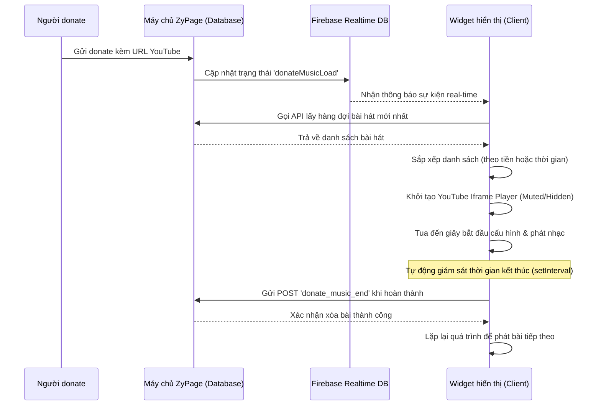

# Nghiên cứu Cơ chế Phát hiện và Phát nhạc từ Donate (ZyPage Donate Music)

Tài liệu này trình bày chi tiết nghiên cứu về cách hệ thống **ZyPage Donate Module** phát hiện các lượt donate bài hát mới và thực hiện phát nhạc tự động bằng YouTube Iframe API.

---

## 1. Cơ chế Phát hiện Lượt Donate Mới (Detection Mechanism)

Hệ thống ZyPage kết hợp hai phương thức để phát hiện và đồng bộ hóa danh sách nhạc donate theo thời gian thực:

### a. Lắng nghe Sự kiện Real-time (Firebase Realtime Database)
Khi người xem gửi một donate đi kèm bài hát hoặc khi streamer tương tác với bảng điều khiển (bỏ qua, tạm dừng bài hát), một sự kiện sẽ được gửi lên **Firebase Realtime Database**. 

Client (màn hình hiển thị widget nhạc của streamer) lắng nghe liên tục tại đường dẫn của cửa hàng:
```javascript
FireBaseApp = firebase.database().ref('ZYPAGE');
FireBaseApp.child("Page/Donate/" + shop_token).on('value', function(snap) {
    var data = snap.val();
    if (data.type == 'donateMusicLoad') {
        donateMusicLoad(); // Tải và phát nhạc mới
    } else if (data.type == 'donateMusicEnd') {
        donateMusicEnd(); // Kết thúc bài hát hiện tại, chuyển bài tiếp theo
    } else if (data.type == 'donateMusicPause') {
        donateMusicPauseToggle(); // Tạm dừng/Phát tiếp bài hát
    }
});
```

### b. Tải Danh sách Nhạc từ Backend API
Khi nhận được tín hiệu cần tải nhạc (`donateMusicLoad`), client sẽ gửi một yêu cầu GET API để lấy danh sách chi tiết các bài hát đang nằm trong hàng đợi của shop:
```javascript
var get_data_response = await get_data_by_url(`/api/get_data_by_id?table=shop&data=donate&id=${shop_id}&v=${server_time}`);
var music_list = get_data_response.data.donate.music.list;
```

---

## 2. Quản lý Hàng đợi & Sắp xếp Thứ tự Phát (Queue Sorting)

Hệ thống hỗ trợ 2 chế độ sắp xếp bài hát ưu tiên tùy theo cấu hình của cửa hàng (`save_data.donate.music.sort`):

1. **Sắp xếp theo Số tiền Donate (`amount`):** Bài hát nào có số tiền donate cao hơn sẽ được xếp lên đầu và phát trước.
   ```javascript
   music_list = Object.values(music_list).sort((a, b) => b.order.amount - a.order.amount);
   ```
2. **Sắp xếp theo Thời gian (`time`):** Bài nào được donate trước sẽ được phát trước (First In First Out - FIFO).
   ```javascript
   music_list = Object.values(music_list).sort((a, b) => a.order.time - b.order.time);
   ```

Bài hát ở vị trí đầu tiên sau khi sắp xếp (`music_list[0]`) sẽ được chọn làm bài hát phát hiện tại: `musicControl.current = music_list[0]`.

---

## 3. Cơ chế Phát nhạc (Playback Mechanism)

Việc phát nhạc được thực hiện thông qua **YouTube Iframe Player API** được chèn động vào trang web.

### a. Khởi tạo Trình phát Ẩn
Một thẻ `div` container dành cho YouTube Player được tạo động, đồng thời khởi tạo một player ẩn (`height: 0`, `width: 0`):
```javascript
musicOverlayData.youtube = new YT.Player('youtube_player_container', {
    height: '0',
    width: '0',
    videoId: videoId,
    playerVars: {
        'autoplay': 1,
        'controls': 1,
        'modestbranding': 1,
        'rel': 0,
        'allowfullscreen': 1
    },
    events: {
        'onReady': onPlayerReady,
        'onStateChange': onPlayerStateChange
    }
});
```

### b. Cấu hình Thời gian Phát (Start, End & Max Duration)
Khi trình phát đã sẵn sàng (`onReady`), hệ thống sẽ tính toán khoảng thời gian cần phát (`clipStart` và `clipStopAt`):
- **Thời điểm bắt đầu (`clipStart`):** Lấy từ cấu hình `music.start` của lượt donate.
- **Thời điểm kết thúc (`clipStopAt`):** Giới hạn bởi cấu hình `music.end` hoặc thời gian phát tối đa cho phép (`max_duration`), bảo vệ streamer khỏi việc phát các bài hát quá dài.

```javascript
function musicOverlayComputePlayback(videoDuration) {
    var start = Math.max(0, Number(musicOverlayData.config.start) || 0);
    var end = Number(musicOverlayData.config.end);
    var maxDur = Number(musicOverlayData.config.max_duration) || 300;
    
    var span = (isFinite(end) && end > start) ? (end - start) : maxDur;
    var playLen = Math.min(span, maxDur);
    var stopAt = start + playLen;
    
    if (isFinite(videoDuration) && videoDuration > 0) {
        stopAt = Math.min(stopAt, videoDuration);
    }
    return { clipStart: start, clipStopAt: stopAt, clipLength: Math.max(0, stopAt - start) };
}
```

Sau khi tính toán, trình phát sẽ thiết lập âm lượng, di chuyển tới thời điểm bắt đầu phát và phát video:
```javascript
target.setVolume(volume);
target.seekTo(pb.clipStart, true);
target.playVideo();
```

---

## 4. Xử lý Chính sách Tự động phát (Autoplay Policy Bypass)

Các trình duyệt hiện đại cấm trang web tự động phát âm thanh khi chưa có tương tác từ người dùng (User Gesture).
Để xử lý vấn đề này:
1. Khi bắt đầu phát, hệ thống chờ khoảng 4 giây để kiểm tra xem YouTube Player có bắt đầu chạy hay không.
2. Nếu trạng thái là `-1` (chưa bắt đầu/bị chặn), hệ thống sẽ ẩn khung phát nhạc đi và hiển thị một thẻ màn hình khóa kích thước toàn màn hình (`.screen_click`) yêu cầu click vào màn hình.
3. Khi người dùng click vào thẻ này, hành động đó được tính là tương tác người dùng, hệ thống sẽ ẩn màn hình khóa và gọi lại `donateMusicLoad()` để tiếp tục phát nhạc thành công.

---

## 5. Giám sát & Chuyển bài tự động (Monitoring & Next Track Transition)

Hệ thống liên tục kiểm tra tiến trình phát của bài hát thông qua một vòng lặp `setInterval` mỗi 500ms:

```javascript
function musicOverlayUpdateState() {
    if (!musicOverlayData.youtube) return;
    var current = Number(musicOverlayData.youtube.getCurrentTime()) || 0;
    var pb = musicOverlayData.playback;
    
    // Nếu thời gian phát hiện tại vượt quá điểm dừng quy định (chừa hao 0.2 giây)
    if (current >= pb.clipStopAt - 0.2) {
        musicOverlayPlaybackEnd(); // Kết thúc phát
        return;
    }
    
    // Cập nhật giao diện thanh tiến trình (progress bar)
    var elapsed = Math.max(0, current - pb.clipStart);
    var pct = Math.min(100, Math.max(0, (elapsed / pb.clipLength) * 100));
    $('.videoPlay-fill').css('width', pct + '%');
    $('.videoPlay-time').text(formatTime(elapsed) + ' / ' + formatTime(pb.clipLength));
}
```

### Quy trình khi Bài hát Kết thúc (`musicOverlayPlaybackEnd`):
1. **Hủy trình phát:** Gọi `musicOverlayData.youtube.destroy()` và dọn dẹp thẻ HTML để giải phóng bộ nhớ.
2. **Cập nhật trạng thái:** Gửi một yêu cầu POST AJAX lên backend để đánh dấu bài hát đã hoàn thành và xóa khỏi danh sách hàng đợi của shop:
   ```javascript
   $.post('/assets/ajax/system.php', {
       action: 'donate_music_end',
       shop_id: shop_id,
       shop_token: shop_token,
       music_key: current_music_key,
   }).done(function(data) {
       musicOverlayData.state.isPlaying = false;
       donateMusicLoad(); // Tiếp tục tải và phát bài tiếp theo trong hàng đợi
   });
   ```

---

## Tóm tắt Mô hình Hoạt động


