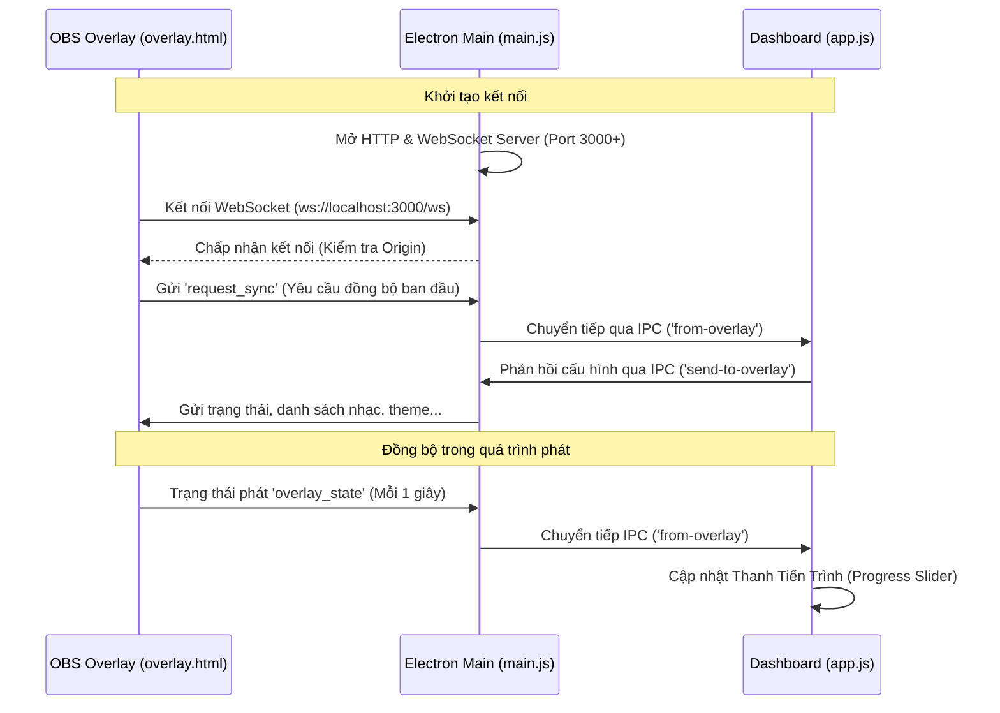

# BÁO CÁO ĐÁNH GIÁ KIẾN TRÚC KẾT NỐI WEBSOCKET GIỮA DASHBOARD VÀ OVERLAY

Báo cáo này phân tích chi tiết thiết kế kết nối truyền thông qua **WebSocket** và cơ chế đồng bộ phụ trợ **LocalStorage** giữa Dashboard (Bảng điều khiển) và OBS Overlay (Giao diện hiển thị) trong ứng dụng **Introvert Player**.

---

## 1. Bản Đồ Luồng Truyền Thông (Communication Architecture)

Mô hình truyền thông của ứng dụng sử dụng cơ chế **lai (hybrid)** kết hợp giữa **WebSocket** (qua Electron Main Process) và **LocalStorage Event Broadcast** (khi chạy cùng Origin).

### Luồng WebSocket (Kênh chính thức)


### Luồng LocalStorage (Kênh dự phòng / Đồng bộ cục bộ)
* Chỉ hoạt động khi **cả Dashboard và Overlay chạy trên cùng một Origin** (Ví dụ: đều chạy dưới dạng `file://` hoặc cùng chạy trên `http://localhost:3000`).
* Sử dụng sự kiện `storage` của trình duyệt để đồng bộ hóa ngay lập tức các thay đổi cấu hình, âm lượng, chuyển bài hát hoặc donation alert.

---

## 2. Các Điểm Hợp Lý và Ưu Điểm (Strengths)

1. **Kiến trúc Lai dự phòng thông minh (Hybrid Fallback):**
   * Kết hợp cả `WebSocket` và `LocalStorage` giúp tối ưu hóa hiệu năng. Nếu Overlay chạy trên cùng Origin với Dashboard, thay đổi trong LocalStorage được bắt trực tiếp giúp đồng bộ gần như tức thời (0ms trễ).
   * WebSocket đảm bảo tính năng đồng bộ hoạt động tốt ngay cả khi Overlay và Dashboard bị phân tách Origin (ví dụ: OBS nạp URL từ địa chỉ IP mạng LAN hoặc domain khác).
2. **Cơ chế Reconnect tự động & dẻo dai:**
   * Overlay tự động thử kết nối lại sau mỗi `3 giây` khi phát hiện ngắt kết nối WebSocket (`onclose` hoặc `onerror`).
   * Gửi định kỳ tin nhắn `request_sync` mỗi `5 giây` để đảm bảo dữ liệu hiển thị không bị lệch hoặc mất đồng bộ lâu.
3. **Xử lý xung đột cổng thông minh (Port Collision Handling):**
   * Electron tự động dò tìm cổng trống từ `3000` trở đi (`createLocalServer(startPort + 1)`). Điều này ngăn ngừa xung đột phần mềm khác đang chạy trên máy của streamer.
4. **Bảo mật cơ bản tốt:**
   * Hàm `isOriginAllowed` lọc các kết nối WebSocket lạ, chỉ chấp nhận `localhost`, `127.0.0.1`, `file://` và `null` (OBS local file). Tránh các website độc hại chiếm quyền điều khiển đầu phát nhạc.

---

## 3. Các Vấn Đề Tồn Tại và Điểm Yếu (Potential Issues & Weaknesses)

### Vấn đề 1: Trùng lặp sự kiện (Double Event Handling) & Race Conditions
* **Chi tiết:** Dashboard đăng ký lắng nghe sự kiện từ cả hai nguồn: sự kiện `storage` cục bộ (dòng 2903 trong `app.js`) và tin nhắn `from-overlay` qua WebSocket (dòng 3107 trong `app.js`).
* **Hệ quả:** 
  * Khi cả hai kênh đều hoạt động tốt (chạy cùng origin `localhost`), Dashboard sẽ nhận thông tin cập nhật trạng thái (`overlay_state`) và sự kiện kết thúc bài (`overlay_event` -> `ended`) **hai lần**.
  * Đối với sự kiện `ended` (kết thúc bài hát), mã nguồn sử dụng điều kiện chặn:
    ```javascript
    if (Date.now() - state.lastSwitchTime < 1500) return;
    ```
    Tuy nhiên, nếu mạng gặp độ trễ cao hoặc sự kiện WebSocket bị hoãn > 1.5 giây, ứng dụng sẽ bị **bỏ qua 2 bài liên tiếp (double skip)**.

### Vấn đề 2: Đứt gãy đồng bộ LocalStorage khi khác Origin
* **Chi tiết:** Streamer thường cấu hình OBS Overlay nạp qua địa chỉ `http://127.0.0.1:3000` trong khi Dashboard chạy trên `http://localhost:3000`. Đối với trình duyệt (nhân Chromium của OBS), `127.0.0.1` và `localhost` là **hai Origin độc lập**.
* **Hệ quả:**
  * Kênh LocalStorage sẽ bị tê liệt hoàn toàn. Toàn bộ quá trình đồng bộ phụ thuộc hoàn toàn vào WebSocket.
  * Nếu WebSocket gặp sự cố (hoặc ngắt kết nối tạm thời), Overlay sẽ không cập nhật trạng thái bài hát mới.

### Vấn đề 3: Lệch cổng (Port Mismatch) khi Overlay chạy trực tiếp từ File
* **Chi tiết:** Trong `overlay.html` (dòng 4824), khi nạp trực tiếp qua giao thức `file://` (không thông qua server localhost), mã nguồn fallback kết nối WebSocket về mặc định `localhost:3000`:
  ```javascript
  const wsHost = window.location.host || 'localhost:3000';
  ```
* **Hệ quả:** Nếu cổng `3000` bị chiếm dụng và Server Electron đã chuyển lên cổng `3001`, Overlay tải trực tiếp từ file sẽ liên tục cố kết nối tới cổng `3000` và thất bại hoàn toàn.

### Vấn đề 4: Nhầm lẫn thuật ngữ (Developer Experience)
* **Chi tiết:** Mã nguồn Dashboard và Overlay đặt tên các hàm là `initMqtt`, `publishMqtt`, `handleMqttMessage`, nhưng thực tế giao thức bên dưới hoàn toàn là **WebSocket gốc (Vanilla WebSocket)**, không sử dụng giao thức MQTT hay MQTT Broker nào. Điều này có thể gây hiểu lầm cho lập trình viên phát triển sau này.

---

## 4. Các Đề Xuất Cải Tiến (Actionable Recommendations)

Nhìn chung, hệ thống kết nối hiện tại **hoạt động ổn định và đáp ứng tốt nhu cầu cơ bản**. Để tối ưu hóa và ngăn chặn các lỗi tiềm ẩn khi stream thời gian dài, chúng tôi đề xuất các giải pháp sau:

### Giải pháp A: Hợp nhất luồng xử lý sự kiện
* **Đề xuất:** Chỉ cho phép Dashboard lắng nghe một nguồn duy nhất tuỳ theo trạng thái chạy. Hoặc tối ưu hơn, gán thuộc tính định danh (UUID) cho mỗi hành động kết thúc bài hát (`ended`).
* **Triển khai:** Khi Overlay phát ra sự kiện `ended`, đính kèm một `event_id` duy nhất (hoặc timestamp). Dashboard lưu lại `lastHandledEventId`. Nếu nhận được sự kiện trùng `event_id` từ kênh thứ hai, Dashboard lập tức bỏ qua.

### Giải pháp B: Chuẩn hóa Origin truy cập OBS Overlay
* **Đề xuất:** Dashboard khi tạo URL OBS cần hiển thị cảnh báo streamer nên sử dụng chính xác URL hiển thị trong Dashboard (đã đồng bộ đúng host và port).
* **Triển khai:** Khóa cứng liên kết sử dụng `localhost` thay vì `127.0.0.1` hoặc ngược lại để đồng bộ hóa tối đa kênh LocalStorage nếu có thể.

### Giải pháp C: Xử lý động Port Fallback cho File cục bộ
* **Đề xuất:** Nếu Overlay nạp trực tiếp từ `file://`, thử quét tuần tự các cổng từ 3000 đến 3005 để tìm Server Electron đang hoạt động thay vì chỉ cố định ở cổng 3000.

---
*Báo cáo được chuẩn bị tự động và ghi nhận vào kho dữ liệu hệ thống.*
